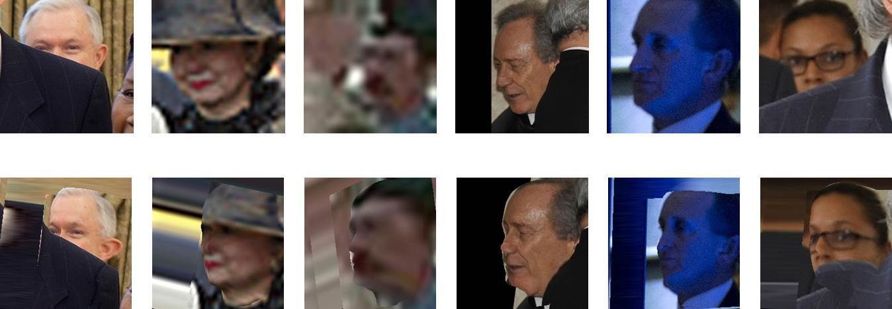
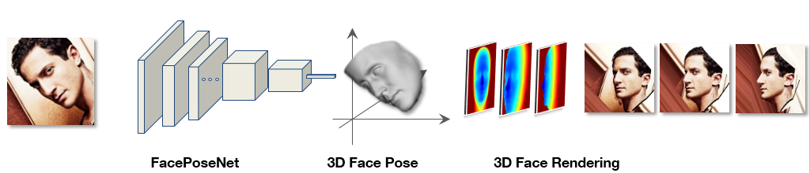

# Face-Pose-Net


<sub>**Extreme face alignment examples:** Faces rendered to a 45 degrees yaw angle (aligned to half profile) using our FacePoseNet. Images were taken from the IJB-A collection and represent extreme viewing conditions, including near profile views, occlusions, and low resolution. Such conditions are often too hard for existing face landmark detection methods to handle yet easily aligned with our FacePoseNet.</sub>
<br/>
<br/>
This page contains DCNN model and python code to robustly estimate 6 degrees of freedom, 3D face pose from an unconstrained image, without the use of face landmark detectors. The method is described in the paper:

_F.-J. Chang, A. Tran, T. Hassner, I. Masi, R. Nevatia, G. Medioni, "[FacePoseNet: Making a Case for Landmark-Free Face Alignment](https://arxiv.org/abs/1708.07517)", in 7th IEEE International Workshop on Analysis and Modeling of Faces and Gestures, ICCV Workshops, 2017_ [1].

This release bundles up our **FacePoseNet** (FPN) with the **Face Renderer** from Masi _et al._ [2,5], which is available separately from [this project page](https://github.com/iacopomasi/face_specific_augm).

The result is an end-to-end pipeline that seamlessly estimates facial pose and produces multiple rendered views to be used for face alignment and data augmentation.



## Updates (Modified and New features, 12/20/2018)
* FPN structure is changed to ResNet-101 for better pose prediction [fpn-resnet101](./ResNet/ThreeDMM_shape.py)
* **Two versions of FPNs (under the assumption of weak perspective transformation) are added**: 
* (1) **Predict 6DoF head pose** (scale, pitch, yaw, roll, translation_x, translation_y):  [main_predict_6DoF.py](./main_predict_6DoF.py)
* (2) **Predict 11 parameters of the 3x4 projection matrix**:  [main_predict_ProjMat.py](./main_predict_ProjMat.py)
* The codes to convert 6DoF head pose to 3x4 projection matrix is [here](https://github.com/fengju514/Face-Pose-Net/blob/fb733f358d9f633f6525a41f3a7a0a99e5c71647/main_predict_6DoF.py#L263-L268) 
* The codes to convert 11 parameters / 3x4 projection matrix to 6DoF head pose is [here](https://github.com/fengju514/Face-Pose-Net/blob/92bd65fa056d17065890e186ca2f2b376a5ab135/main_predict_ProjMat.py#L306-L308)
* The corresponding 3D shape and landmarks can be obtained by predicted 6DoF head pose [3D shape from 6DoF](https://github.com/fengju514/Face-Pose-Net/blob/92bd65fa056d17065890e186ca2f2b376a5ab135/main_predict_6DoF.py#L271-L297) or by predicted 11 parameters [3D shape from 11 parameters](https://github.com/fengju514/Face-Pose-Net/blob/92bd65fa056d17065890e186ca2f2b376a5ab135/main_predict_ProjMat.py#L272-L297)
* Download new FPN models: Please put all model files [here](https://www.dropbox.com/sh/lr9u4my1qrhmgik/AADQVUIHSJIUXqUAj1AoZMIGa?dl=0) in the folder `models`
* Download BFM models: Please put BFM shape and expression files [here](https://www.dropbox.com/sh/ru7ierl9516a9az/AABTP9hJj3dJnapicFFgHmOna?dl=0) in the folder `BFM`
* Run new FPN to predict 6DoF head pose:
```bash
$ python main_predict_6DoF.py <gpu_id> <input-list-path>
```
* Run new FPN to predict 11DoF parameters of the projection matrix:
```bash
$ python main_predict_ProjMat.py <gpu_id> <input-list-path>
```
We provide a sample input list available [here](./input_list.txt).
```bash
<FILE_NAME, FACE_X, FACE_y, FACE_WIDTH, FACE_HEIGHT>
```
where `<FACE_X, FACE_y, FACE_WIDTH, FACE_HEIGHT>` is the x,y coordinates of the upper-left point, the width, and the height of the tight face bounding box, either obtained manually, by the face detector or by the landmark detector. The predicted 6DoF and 11DoF results would be saved in [output_6DoF folder](https://github.com/fengju514/Face-Pose-Net/blob/a7923b764f92892021297fd046065c22a41dc519/main_predict_6DoF.py#L232-L236) and [output_ProjMat folder](https://github.com/fengju514/Face-Pose-Net/blob/a7923b764f92892021297fd046065c22a41dc519/main_predict_ProjMat.py#L235-L239) respectively. The output 3D shapes and landmarks by 6DoF and 11DoF are saved in [output_6DoF folder](https://github.com/fengju514/Face-Pose-Net/blob/a7923b764f92892021297fd046065c22a41dc519/main_predict_6DoF.py#L301) and in [output_ProjMat folder](https://github.com/fengju514/Face-Pose-Net/blob/a7923b764f92892021297fd046065c22a41dc519/main_predict_ProjMat.py#L301) respectively. You can visualize the 3D shapes and landmarks via Matlab.


* The same renderer can be used. Instead of feeding into the 6DoF pose, you need to feed into the predicted landmarks either from 6DoF head pose or from 3x4 projection matrix. Please see an example in demo.py of [this project page](https://github.com/iacopomasi/face_specific_augm)

## Features
* **6DoF 3D Head Pose estimation** + **3D rendered facial views**.
* Does not use **fragile** landmark detectors
* Robustness on images landmark detectors struggle with (low rez., occluded, etc.)
* Extremely fast pose estimation
* Both CPU and GPU supported
* Provides better face recognition through better face alignment than alignment using state of the art landmark detectors [1]

## Dependencies

* [TensorFlow](https://www.tensorflow.org/)
* [OpenCV Python Wrapper](http://opencv.org/)
* [Numpy](http://www.numpy.org/)
* [Python2.7](https://www.python.org/download/releases/2.7/)

The code has been tested on Linux only. On Linux you can rely on the default version of python, installing all the packages needed from the package manager or on Anaconda Python and install required packages through `conda`. 

**Note:** no landmarks are used in our method, although you can still project the landmarks on the input image using the estimated pose. See the paper for further details. 

## Usage

* **Important:** In order to download **both** FPN code and the renderer use `git clone --recursive`
* **Important:** Please download the learned models from https://www.dropbox.com/s/r38psbq55y2yj4f/fpn_new_model.tar.gz?dl=0   and make sure that the FPN models are stored in the folder `fpn_new_model`.

### Run it

The alignment and rendering can be used from the command line in the following, different ways.

To run it directly on a list of images (software will run FPN to estimate the pose and then render novel views based on the estimated pose):

```bash
$ python main_fpn.py <input-list-path>
```

We provide a sample input list available [here](input.csv).
```bash
<ID, FILE, FACE_X, FACE_y, FACE_WIDTH, FACE_HEIGHT>
```
where `<FACE_X, FACE_y, FACE_WIDTH, FACE_HEIGHT>` is the face bounding box information, either obtained manually or by the face detector. 

## Sample Results
Please see the input images [here](images) and rendered outputs [here](output_render).

### input: ### 

### rendering: ### 


## Current Limitations
FPN is currently trained with a single 3D generic shape, without accounting for facial expressions. Addressing these is planned as future work.

## Citation

Please cite our paper with the following bibtex if you use our face renderer:

``` latex
@inproceedings{chang17fpn,
      title={{F}ace{P}ose{N}et: Making a Case for Landmark-Free Face Alignment},
      booktitle = {7th IEEE International Workshop on Analysis and Modeling of Faces and Gestures, ICCV Workshops},
      author={
      Feng-ju Chang
      and Anh Tran 
      and Tal Hassner 
      and Iacopo Masi 
      and Ram Nevatia
      and G\'{e}rard Medioni},
      year={2017},
    }
```

## References
[1] F.-J. Chang, A. Tran, T. Hassner, I. Masi, R. Nevatia, G. Medioni, "[FacePoseNet: Making a Case for Landmark-Free Face Alignment](https://arxiv.org/abs/1708.07517)", in 7th IEEE International Workshop on Analysis and Modeling of Faces and Gestures, ICCV Workshops, 2017

[2] I. Masi\*, A. Tran\*, T. Hassner\*, J. Leksut, G. Medioni, "Do We Really Need to Collect Million of Faces for Effective Face Recognition? ", ECCV 2016, 
    \* denotes equal authorship

[3] I. Masi, S. Rawls, G. Medioni, P. Natarajan "Pose-Aware Face Recognition in the Wild", CVPR 2016

[4] T. Hassner, S. Harel, E. Paz and R. Enbar "Effective Face Frontalization in Unconstrained Images", CVPR 2015

[5] I. Masi, T. Hassner, A. Tran, and G. Medioni, "Rapid Synthesis of Massive Face Sets for Improved Face Recognition", FG 2017

## Changelog
- August 2017, First Release 

## Disclaimer

_The SOFTWARE PACKAGE provided in this page is provided "as is", without any guarantee made as to its suitability or fitness for any particular use. It may contain bugs, so use of this tool is at your own risk. We take no responsibility for any damage of any sort that may unintentionally be caused through its use._

## Contacts

If you have any questions, drop an email to _fengjuch@usc.edu_, _anhttran@usc.edu_, _iacopo.masi@usc.edu_ or _hassner@isi.edu_ or leave a message below with GitHub (log-in is needed).
